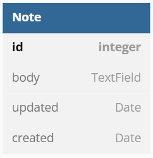
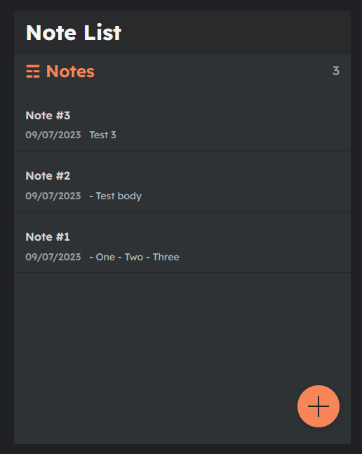

# Fullstack app project of a notes manager

 
 

## Purpose of the project

This is a training project to practice my skills in **Full-stack development** (Backend and Frontend)

The aim of this project is to create a note application. The user should be able to **read**, **create**, **modify** and **delete** personnal notes.

This application communicate with a **Database** stored in the **backend** side (**Django framework**) through a **REST API**

The **Frontend** side is using **React.Js framework**

## Stack of the project :

 /            | Backend        | Frontend
------------- | -------------- | ------------- 
framework     | Django         | React        
Language      | Python (v3.10) | Javascript - HTML - CSS

## Functionalities :
* **Show** Notes from the database
* **Edi**t Notes from the database
* **Add** new Notes to the database
* **Delete** Notes from the database

## Rest API roots :

### Get all notes :
> **GET** /notes/

### Get a note by primary key :
> **GET** /notes/id

### Add a new note :
> **POST** /notes/

### Update a note by primary key :
> **PUT** /notes/id

### Delete a note by primary key :
> **DELETE** /notes/id

## Database Model :

## Preview of the project :

